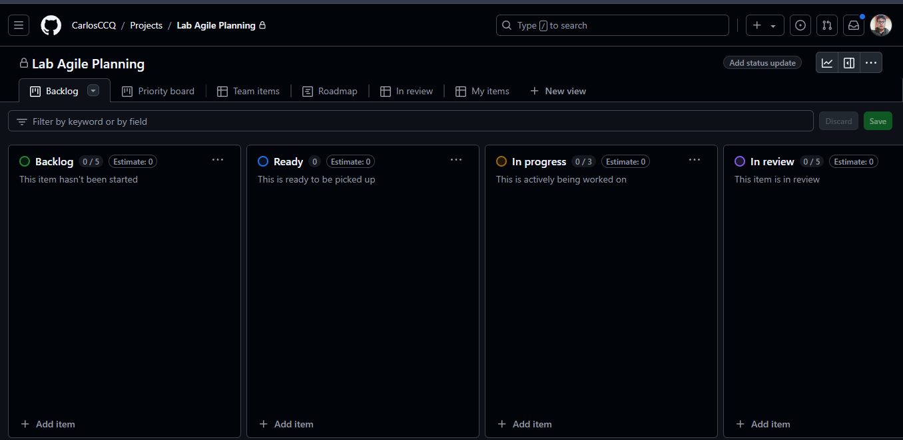
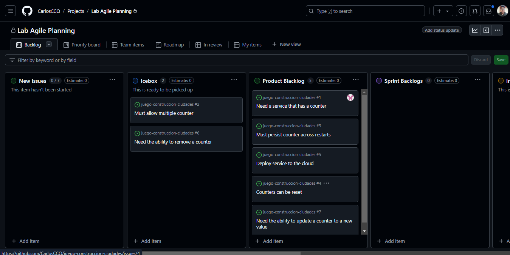

## Actividad: Gestión ágil de proyectos con GitHub Projects: Configuración de Kandan Board y Creación de Historias de Usuario

#### Objetivos:

* Confiugrar y personalizar un Kandan board en GitHub Projects para gestionar el glujo de trabajo de manera eficiente.
* Crear y utlizar plantillas de issues en GitHub oara estandarizar la escritura de historias usuario.
* Organizar y priorizar el product backlog mediante la creación, edición y reordenación de historias de usuario en el Kandan board.
* Realizar el refinamiento del backlog, preparando las historias para el sprint  y asegurando la correcta asignación de etiquetas y categorías.
* Utilizar GitHub Projects como una herramienta efectiva para la planificación, seguimiento y entrega de proyectos ágiles.

### Parte 1

En este ejercicio, aprenderás cómo configurar un Kandan board usando GitHub Projects pra el repositorio del curso. Puedes crear otro repositorio si deseas.

1. Navega al repositorio del curso donde has trabajo en GitHub.
2. Una vez que estés en la página del repositorio, haz clic en la pestaña Project, como se muestra en la captura de pantalla o continuación.

3. Al lado del botón Link project, haz clic en el menú desplegable y selecciona New Project.
4. Después de hacer clic en el botón New Projects, aparecerá una ventana emergente para crear un proyecto. Selecciona Kandan, Como se muestra en la captura de pantalla.

5. Nombra tu proyecto como Lab Agile Planning y procede haciendo clic en el botón Create project.

6. En el Kandan board del proyecto, tendrás columnas para representar diferentes etapas de tu flujo de trabajo, como Backlog, Ready, In Progress, In review, y Done. Puedes agregar columnas personalizar según los requisitos de tu flujo de trabajo.

7. Para personalizar o modificar el nombre de una columna, haz clic en los tres puntos y luego selecciona Edit detalls.

8. Cuando hagas clic en Edit details, aparecerá una ventana emergente, como se muestra en la captura de pantalla o continuación. Introduce el nombre de la columna requerido en el cuadro de texto resaltado. Puedes agregar una descripción apropiada o elegir eliminarla, luego haz clic en Save para confirmar los cambios.
* De manera similar, renombrar las columnas restantes de la siguiente manera:
1 Renombrar la columna Ready a Icebox.
2 Deja la columna In Progress tal como está.
3 Renombra la columna In review a Review/QA.
4 Deja la columna Done tal como está.

9. Después de realizar los cambios mencionados, tu Kandan board debería verse así:

10. Para agregar una nueva columna, navega al final de las columnas existentes y haz clic en el botón +. Luego, selecciona New column de las opciones. Introduce el nombre de la columna como Product Blacklog en el campo de texto Label, y finalmente, haz clic en Save para aplicar los cambios.

11. Para establecer la secuencia correcta en el Kandan board, arrastra la columna Product Backlog y colóca antes de la columna In Progress. La fecha en la captura de pantalla a continuación indica desde dondé necesitas arrastrar y soltar la columna.

12. De manera similar, crea la columna Sprint Backlogs, y luego reorganizala para que se asemeje al Kandan mostrado a continuación.

### Parte 2
En este ejercicio, crearás una issue template en GitHub que te ayudará a escribir historias de usuario bien formatadas en el Kandan board.

#### Crear un issue template en GitHub
En este ejercicio, crearás una issue template en GitHub. Esto solo necestia hacerse una vez para cada nuevo repositorio que crees.

1. En la página del repositorio que usaste en el ejercicio anterior, selecciona Settings.
2. Desplázate hacia abajo hasta el sección Features y selecciona Set up templates.

3. En la lista desplegable etiqueta Add template (1), selecciona Custom template (2).

4. Al lado de la entrada Custom Issue template, presione el botón Preview and edit.
5. Selecciona el icono de lapíz para editar el template.
6. Copia el siguiente markdown para el contenido de la plantilla de historia.

7. Cambia el template a User Story, dale una descripción apropiada, y pega el contenido del markdown anterior en el Template content.

8. Desplázate hacia la parte superior de la página y presiona el botón Propose changes.
9. Presiona el botón Commit changes para confirmar el cambio en tu repositorio.

10. Ahora deberias tener una nueva carpeta en tu repositorio llamada .github/ISSUE_TEMPLATES, que contendrá tu nueva issue template de historia de usuario.

Ahora tienes una issue template que puedes usar para todos tus repositorios de GitHub en los que necesites escribir historias para usar en el Kandan board. Cuando creemos issues en los laboratorios futuros, esta template te guiará sobre qué información es necesaria para crear tu historia de usuario.

### Parte 3
En este ejercicio crearás siete historias de usuario basadas en los requisitos dados. Las primeras cuatro se te proporcionarán. Solo tendrás que copiarlas y pegarlas para familiarizarte con la creación de historias de usuario de GitHub. Deberás crear las últimas tres historias de usuario por ti mismo.
Luego priorizarás estas historias y las moverás a las columnas apropiadas en tu Kandan board.

##### Objetivos
Después de completar este laboratorio, podrás:
* Crear nuevas historias de usuario usando GitHub issues.
* Priorizar el product backlog.

1. Crear nuevas historias de usuario usando GitHub issues

En este ejercicio, crearás las siguientes historias de usuario usando GitHub issues:
Historias de la lección:

* Título: Need a service that has a counter
    * Como un usuario, necesito un servicio que tenga un contador para que pueda hacer un seguimiento de cuántas veces se ha hecho algo.
    * Puedes usar esta versión en inglés si deseas: As a user, I need a service that has counter so that I can keep track of how many times something has been donde.
* Título: Must allow multiple counters
    * Como un usuario, necesito tener multiples contadores para que pueda hacer un seguimiento de varios conteos a la vez.
    * Puedes usar esta versión en inglés si deseas: As a usar, I need to have multiple counters so that I can keep track of several counts at once.
* Título: Must perssit counter across restarts
    * Como proveedor de servicios, necesito que el servicio persista el último conteo conocido para que los usuarios no puerdan el seguimiento de sus conteos después de que el servicio se reinicie.
    * Puedes usar esta versión en inglés si deseas: As a service provider, I need the service to persist the last known count so that users don't lose track of their counts after the service is restarted.
* Título: Counter can be reset
    * Como administrador del sistema, necesito la capacidad de reiniciar el contador para que pueda rehacer el conteo desde el principio.
    * Puedes usar esta versión en inglés si deseas: As a system administrator, I need the ability to reset the counter so that I can redo counting from the start.

Nuevos requisitos:

* Deploy service to the cloud
* Need the ability to remove a counter
* Need the ability to update a counter to a new value

##### Requisito previo:

Asegúrate de haber creado la Issue template. Si la template aún no se ha creado, completa el ejercicio anterior.

1. Ve a la pestaña Issue del repositorio del curso o donde estés trabajando la actividad.
2. Haz clic en el botón New issue.

3. Verás tu template listada aquí. Haz clic en el botón Get Started.
4. Introduce el título para la primera historia como Need a setvice that has a counter y actualiza la sección de historia de usuario (es decir, As a, I need, So that) por ahora. Una vez hecho, haz clic en el botón Submit new issue.

5. Tu primera historia de usuario ahora está creda y debería parecerse a la captura de pantalla mostrada a continuación.

6. Agregar la historia de usuario creada al Kandan board, haz clic en el botón de configuración al lado de la opción Project, y luego elige el proyecto Lab Agile Planning del menú desplegable que creaste en el ejercicio anterior.

7. A continuación, selecciona el menú desplegable Status y elige New Issues. Esta acción moverá la historia creada a la columna 'New Issues' en el Kandan board.

8. Para ver la historia de usuario recién creada en el Kandan board, navega a la pestaña Project y selecciona el proyecto titulado Lab Agile Planning.

9. Notarás que la historia de usuario recién creada ahora está listada bajo la columna New Issues.

10. Dado que debemos crear un total de siete historias de usuario, ajustemos el limite predeterminado a 7. Para lograr esto, haz clic en los tres puntos de la columna New Issues, luego selecciona la opción de Set limit.

11. Introduce el limite como 7 en el campo de texto Collumn limit y haz clic en Save. Ten en cuenta que, similar a esto, puedes optar por modificar los limites de otras columnas o mantener los limites predeterminados.

12. Para regresar a la pestaña Issues para crear nuevas historias de usuario, simplemente haz clic en el boton de retroceso del navegador.

13. Continúa agregando historias hasta que las siete estén creadas y Kandan board se parezca a la captura de pantalla mostrada a continuación. Las primeras cuatro historias se proporcionan en la lección. Deberás crear tu propio rol, función y beneficio para las últimas tres historias.

#### Ejercicio: Priorizar el product backlog

En este ejercicio, moverás issues entre columnas para recrear el Kandan board del video de la lección Building the Product Backlog. Esto simulará un punto de partida inicial para nuestro próximo laboratorio simplemente arrastrándolos y soltándolos de una columna a otra.

1. Mueve la historia Need a service that has a counter al inicio de la columna Product Backlog.
2. Mueva la historia Must allow multiple counters a la columna Icebox.
3. Mueve la historia Must persist counter across restarts al final de la columna Product Backlog.
4. Mueve la historia Counters can be reset al final de la columna Product Backlog.
5. Deja las historias restantes en la columna New Issues pro ahora. Las moveremos en un laboratorio posterior.

Al finalizar este ejercicio, su tablero Kandan debería verse como el que se muestra a continuación:

### Parte 4
En este ejercicio, seguirás los pasos llevar a cabo una reunión de refinamiento del backlog.
Serás el productor owner preparando el product backlog para tu próxima reunión de planificación del sprint. Esto implica preparar las historias que creamos en el úttimo en el último ejercicio para hacerlas listas para el sprint.

##### Objetivos
Después de completar este ejercicio, podrás:
* Triage de nuevos issues
* Hacer que las historias estén listas para el sprint
* Crear nuevas labels
* Añadir labels a las historias

##### Estado inicial
Al completar el ejercicio anterior tu Kandan bederia verse así:

* New issues:
    * Deploy service to the cloud
    * Need the ability to remove counter
    * Need ability to update a cpunter to a new value
* Icebox:
    * Must allow multiple counters
* Product Backlog:
    * Need a service that has a counter
    * Must persist counter across restarts
    * Counters can be reset

1. Triage de nuevos issues
En este ejercicio, tomarás todas las historias en la columna New Issues y las moveras a una columna apropiada o las rechazarás.

    1. Ve a github.com e inicia sesión con tu cuenta de GitHub y abre tu Kandan board.
    2. El primer nuevo issue es Deploy service to the cloud. Queremos ahcer eso después de agregar persistencia, así que muévelo a la columna Product Backlog bajo Must persist counter across restarts.
    3. El siguiente nuevo issue es Need the ability to remove a counter. Solo tenemos un contador y no quisiéramos eliminarlo, así que muévelo al Icebox después de Must allw multiple counters.
    4. El último nuevo issue es Need ability to update a counter to a new value. Podríamos querer hacerlo como una mejora después de poder reiniciar el contador, así que muévelo al Product Blacklog después de Counters can be reset.

Ahora has completado el triage de nuevos issues y puedes comenzar a hacer que las historias en la columna Product Backlog estén listas para el sprint.

2. Hacer que las historias estén listas para el sprint

En esta parte, agregarás más detalles a las historias en el Product Backlog que creas podrían entrar en el próximo sprint. Se te proporcionarán lso detalles para dos de las historias. Debes proporcionar los detalles para las otras tres.

2.1 Selecciona la primera historia en la parte superior de la columna Product Backlog para abrirla. Haz clic en los tres puntos y luego selecciona el botón Edit para editar el issue.
2.2 Edita los Details y Assumptions para que los desarrolladores sepan lo que sabemos, y edita los Acceptance Criteria para asegurar que todos entiendan cuál es la definición de "hecho".

2.3 Cuando termines de editar, presiona el botón Save pra guardar las edificiones.
2.4 Cierra la ventana presionando el icono de X.
2.5 Edita la historia Must persist counter across restarts de la misma manera y haz que se vea como la siguiente:

2.6 Edita las siguientes historias con tus propios detalles, suposiciones y criterios de aceptación:

* Deploy service to the cloud

* Counters can be reset

* Need ability to update a counter to a new value

Al completar este ejercicio, tu Kanban doard debería tener suficientes detalles en todas las historias del Product Blacklog para hacerlas listas para el sprint.

3. Crear nuevas labels en GitHub

En este ejercicio, crearás una nueva label en GitHub llamada 'technical debt' para marcar aquellas historias que no aportan valor visible al cliente pero deben completarse para continuar con el desarrollo.

3.1. Desde la página de tu repositorio, selecciona la pestaña Issues.
3.2. Desde la página de issues, selecciona el botón Labels.
3.3 Desde la página de labels, selecciona el botón New label.
3.4 En la sección de nueva label: (1) establece el nombre de la label como technical debt, (2) establece el Color como amarillo (#FBCA04), y luego (3) presiona el botón Create label.

3.5 Ahora deberias ver una label amarilla technical bedt que podemos usar pra anotar nuestras historias.

4. Añadir labels a las historias

En este ejerccio, añadiras labels a las historias en el Product Backlog para hacerlas aún más listas para el sprint. También usaras nuestra nueva label llamada technical bedt pra marcar aquellas historias que no aportan valor visible al cliente pero deben completarse para continuar con el desarrollo.

4.1 Selecciona la primera historia en la parte superior de la columna Product Backlog para abrirla. Luego, presiona el icono de engranaje al lado de Labels para signar un label.

4.2 Nuestra primera historia es una mejora a nuestro producto. Desde el menú de labels, selecciona enhancement para reflejar eso.

4.3 Haz clic en cualquier parte fuera del menú de labels para cerrarlo. Ahora deberías ver que la label enhancement ha sido asignada a esta historia.

4.4 Selecciona cada una de las siguientes historias en la columna Product Backlog y asignales las labels correspondientes:

* Must persist counter across restarts
  Label: enhancement
  Característica: Esto implica una mejora al sistema existente, ya que se añade la funcionalidad de persistencia de contador.

* Deploy service to the cloud Label: technical debt
  Label: technical debt
  Característica: Desplegar el servicio en la nube generalmente se considera una deuda técnica, ya que puede ser una tarea pendiente que requiere atención para mantener el sistema moderno y escalable.

* Counters can be reset
  Label: enhancement
  Característica: Esta es una mejora funcional que agrega una nueva capacidad al sistema, permitiendo a los usuarios reiniciar los contadores.

* Need ability to update a counter to new value
  Label: enhancement
  Característica: Esta hsitoria describe una mejora que permite actualizar un contador a un nuevo valor, añadiendo flexibilidad y precisión al uso del sistema.

Nota: SI has añadido las labels pero no las ves en el Kanban board, sigue estos pasos:

* Abre el menú desplegable al lado de Backlog (resaltado como 1 en la captura de pantalla a continuación).
* Haz clic en la flecha al lado de la opción Fields (resaltado como 2).
* Arrastra y suelta Labels de la lista de campos ocultos a la lista campos visibles (resaltado 3)
* Haz clic en el botón Save (resaltado como 4) para guardar los cambios.

Al final de este ejercicio, tu Kanban board debería verse así:

